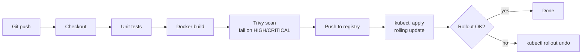

# Jenkins CI/CD Pipeline to Kubernetes

A declarative Jenkins pipeline that tests, builds, scans, pushes and deploys a small Node.js service to a Kubernetes cluster (EKS, GKE, or a local kind/minikube cluster), with automatic rollback on failure.

## Pipeline

Jenkins runs in a controller + agent setup: the controller schedules jobs and the agent (label `docker-agent`) does the build work.

## Setup
1. Run a Jenkins controller and connect an agent labelled `docker-agent` with docker, kubectl, node, trivy and envsubst installed.
2. Add Jenkins credentials: `dockerhub-creds` (username/password) and `kubeconfig` (secret file).
3. Edit `REGISTRY` in the `Jenkinsfile`.
4. Create a Pipeline job pointing at this repo.

## Design choices
- Rolling update with `maxUnavailable: 0` and readiness probes, so deploys have no downtime
- Images tagged with the build number, never `latest`, so every deploy is traceable
- Container runs as non-root
- Secrets only come from Jenkins credentials
