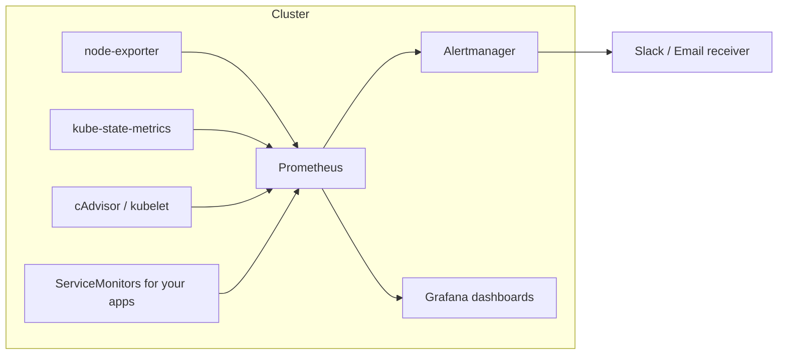

# Kubernetes Observability Stack (Prometheus + Grafana + Alertmanager)

Deploys `kube-prometheus-stack` on a Kubernetes cluster (GKE, EKS, or local) with custom alert rules for workload and node health.

## Architecture



## Install
```bash
export GRAFANA_ADMIN_PASSWORD='choose-a-strong-one'
./install.sh
```

## What is included
- `values.yaml` - retention, resources, Alertmanager routing, Grafana dashboard sidecar
- `alerts.yaml` - alerts for crash-looping pods, replica mismatch, CPU throttling, node memory and disk
- Default Kubernetes dashboards from the chart

## Adding an app
Expose `/metrics` from your app and create a `ServiceMonitor` for it. Then build latency and error-rate panels and SLO alerts on those metrics.

## Next steps
- Set up a real Alertmanager receiver (Slack webhook)
- Add application-level SLO alerts (error rate, p95 latency) once an app exposes metrics
