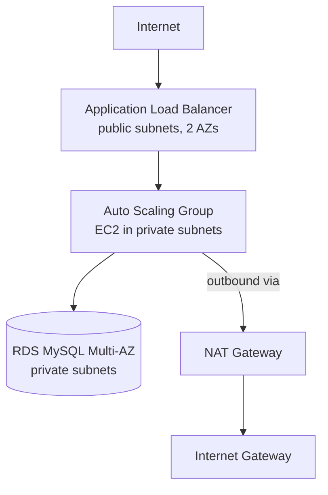

# Multi-AZ AWS Infrastructure with Terraform

Modular Terraform that builds a highly available web tier on AWS: a VPC across two AZs, an Application Load Balancer, an Auto Scaling Group in private subnets, and a Multi-AZ RDS MySQL database.

## Architecture



## Structure
- `modules/vpc` - VPC, public/private subnets, IGW, NAT, route tables
- `modules/alb_asg` - ALB, target group, launch template, ASG, CPU target-tracking policy
- `modules/rds` - encrypted RDS MySQL, password managed by Secrets Manager

## Security choices
- App instances and DB sit in private subnets, with no public IPs
- DB accepts traffic only from the app security group
- IMDSv2 enforced, storage encrypted, no passwords in code

## Usage
```bash
terraform init
terraform plan
terraform apply
# open the alb_dns_name output in a browser
terraform destroy   # always destroy when done: NAT, ALB and RDS cost money
```

## Known limitations
- Single NAT gateway (use one per AZ for production)
- HTTP only, no TLS/ACM certificate
- `skip_final_snapshot = true` is for demo use
